# Feature → API Dependency Map

All 22 system features and which API key each one requires.

```mermaid
flowchart TD
    subgraph KEYS["API Keys"]
        OAI["OPENAI_API_KEY\n━━━━━━━\nRequired"]
        ANT["ANTHROPIC_API_KEY\n━━━━━━━\nOptional · best LLM"]
        GOO["GOOGLE_API_KEY\n━━━━━━━\nOptional · free tier"]
        ORT["OPENROUTER_API_KEY\n━━━━━━━\nOptional · free"]
        COH["COHERE_API_KEY\n━━━━━━━\nOptional · reranking"]
        OLL["Ollama local\n━━━━━━━\nNo API · offline"]
    end

    LLM(["⛓ Active LLM\nauto-selected · first responder wins"])

    ANT  -->|"① claude-sonnet · best"| LLM
    OAI  -->|"② gpt-4o · high quality"| LLM
    GOO  -->|"③ Gemini 2.5 Pro · paid"| LLM
    ORT  -->|"④ DeepSeek V3 · free"| LLM
    GOO  -->|"⑤ Gemini 2.5 Flash · free"| LLM
    OLL  -->|"⑥ llama3.2 · offline"| LLM

    OAI --> VEC["📐 Vector indexing\ntext-embedding-3-small"]
    OAI --> SEM["💾 Semantic cache\n92% threshold · 7-day TTL"]
    OAI --> VER_E["✅ Answer verification\nembedding similarity check"]
    OAI --> KGE["🕸 KG extraction\ngpt-4o-mini · default config"]

    LLM --> ANS["💬 Answer generation"]
    LLM --> DEC["🔀 Query decomposition\ncomplex → sub-queries"]
    LLM --> REW["✏️ LLM query rewrite"]
    LLM --> SRAG["🔄 Self-RAG retry\nconfidence < 70%"]
    LLM --> COD["🔨 Plugin code generation"]
    LLM --> FIX["🔧 Self-improvement loop\nvalidate → fix · up to 5×"]
    LLM --> VER_L["✅ Answer verification\nLLM grounding · borderline only"]

    COH --> RERANK["🎯 Neural reranking\nCohere rerank-english-v3.0"]
    BGE["BGE → FlashRank\nlocal · no API needed"] -.->|if no Cohere key| RERANK

    subgraph LOCAL["No API — Local / Free"]
        direction LR
        L1["📂 Document loading\n.md  .h  .cpp"]
        L2["📝 Markdown chunking\nMarkdownNodeParser"]
        L3["⟨⟩ Code chunking\ntree-sitter AST"]
        L4["🔍 BM25 keyword indexing"]
        L5["⚡ 3-way fusion retrieval\nreciprocal rank fusion"]
        L6["🔁 Query synonym expansion\n60+ BakkasMod domain mappings"]
        L7["📊 Confidence scoring"]
        L8["🛡 Circuit breakers + rate limiting"]
        L9["💰 Cost tracking + budget enforcement"]
        L10["📋 Structured logging"]
        L11["🔬 SDK class browser\nCppAnalyzer · tree-sitter"]
        L12["🔨 C++ validation\nMSVC compilation check"]
        L13["🔌 MCP server\nClaude Code integration"]
    end
```

## Quick Reference

| API Key | Required? | Features |
|---|---|---|
| `OPENAI_API_KEY` | **Yes** | Vector indexing, semantic cache, answer verification (embedding), KG extraction, OpenAI GPT-4o LLM (fallback #2) |
| `ANTHROPIC_API_KEY` | No | LLM fallback #1 — claude-sonnet (best quality) |
| `GOOGLE_API_KEY` | No | LLM fallback #3 (Gemini 2.5 Pro · paid) and #5 (Gemini 2.5 Flash · free tier) |
| `OPENROUTER_API_KEY` | No | LLM fallback #4 — DeepSeek V3 (free) |
| `COHERE_API_KEY` | No | Neural reranking (falls back to BGE → FlashRank locally if absent) |
| Ollama local | No | LLM fallback #6 — llama3.2 offline, no internet required |

## Notes

- **`OPENAI_API_KEY` has two roles**: embeddings (always used) and LLM position #2 in the fallback chain.
- **Active LLM** is resolved once at startup via live `"Say OK"` test calls — first provider that responds wins. All LLM-dependent features use that single resolved provider.
- **Reranking** is always active (`enable_reranker=True`); the Cohere key only determines *which* reranker is used (Cohere vs local BGE/FlashRank).
- **13 features require no external API** and work fully offline (except document loading needs the index to be built first).
